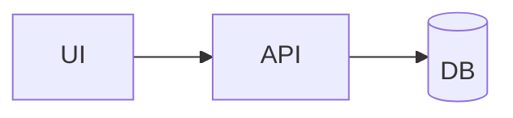

# README Template

元資料の強かった README パターンを、各リポジトリに流用しやすい形に圧縮したテンプレートです。

```markdown
# {プロジェクト名}

> {1行説明}

## 📋 概要

| 項目 | 内容 |
|---|---|
| プロジェクト名 | {name} |
| 目的 | {goal} |
| 主な利用者 | {users} |
| 技術スタック | {stack} |
| 準拠規格 | {iso/nist/etc} |

## 🚀 主な機能

| 機能 | 説明 |
|---|---|
| {feature} | {desc} |

## 🏗️ アーキテクチャ



## ⚙️ セットアップ

```bash
{setup commands}
```

## 🧪 品質保証

| 項目 | 内容 |
|---|---|
| test | {command} |
| lint | {command} |
| build | {command} |

## 📚 ドキュメント

| 文書 | パス |
|---|---|
| 要件定義 | `{path}` |
| 詳細設計 | `{path}` |
```

## 更新基準

次のどれかが変わったら README 更新を推奨します。

- 利用者が触る機能
- セットアップ手順
- アーキテクチャ
- 品質ゲート
